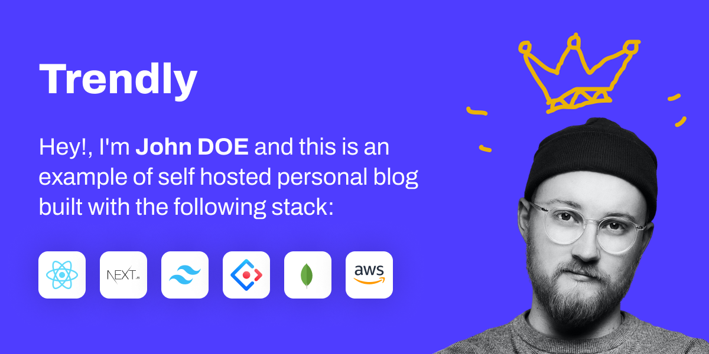
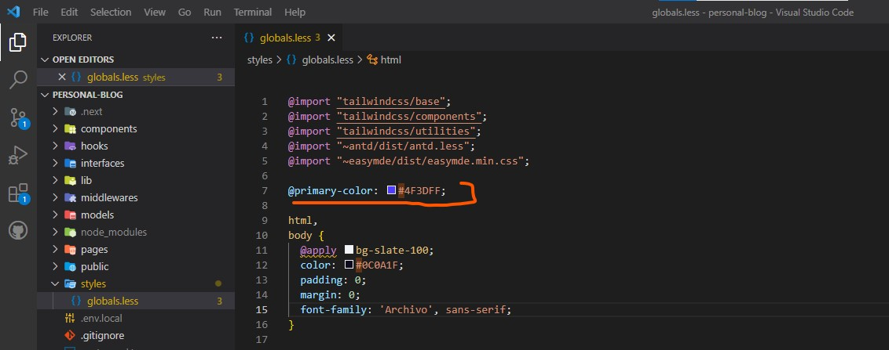
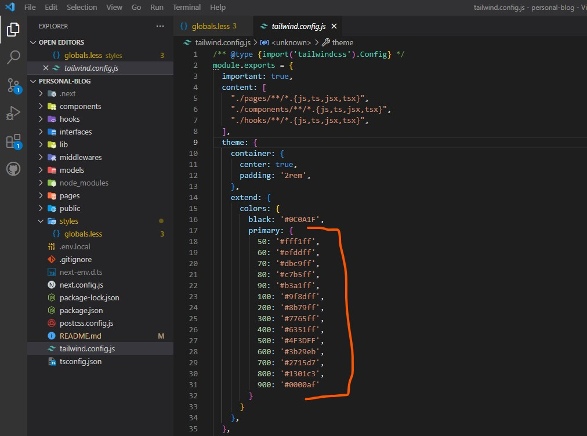
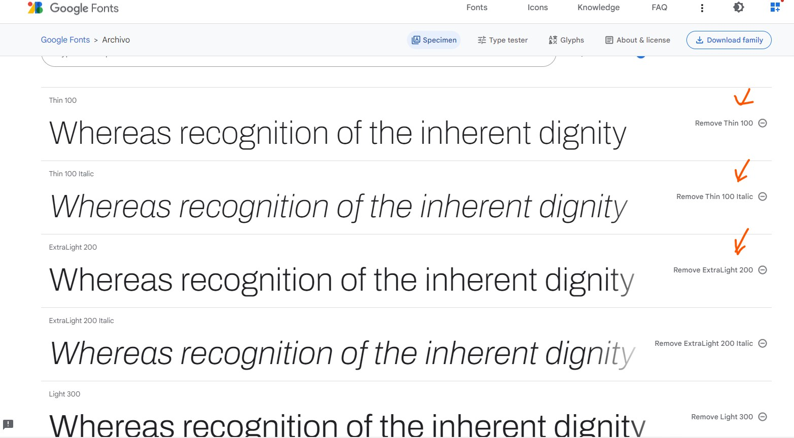
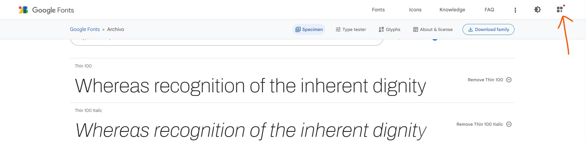
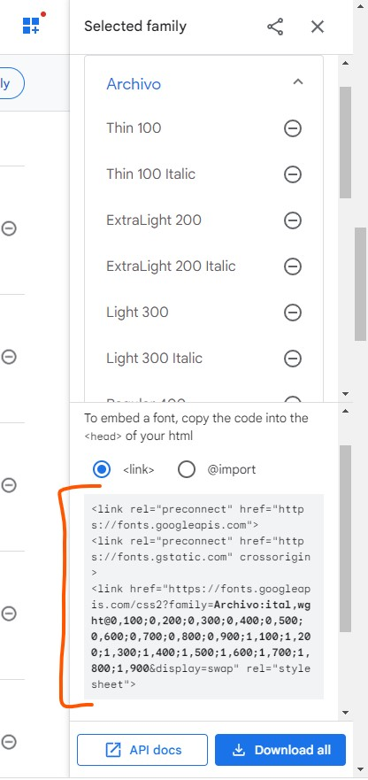
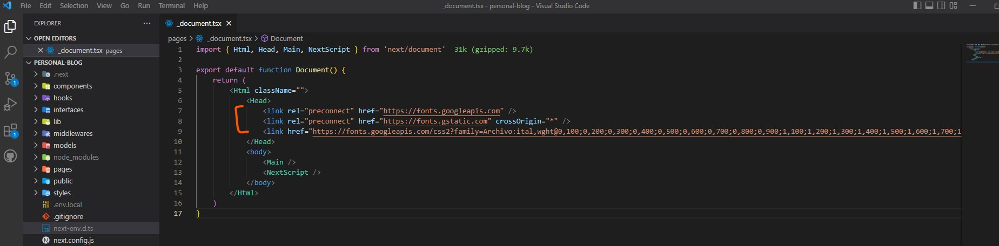
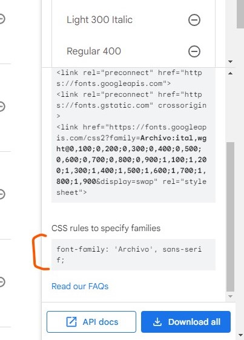
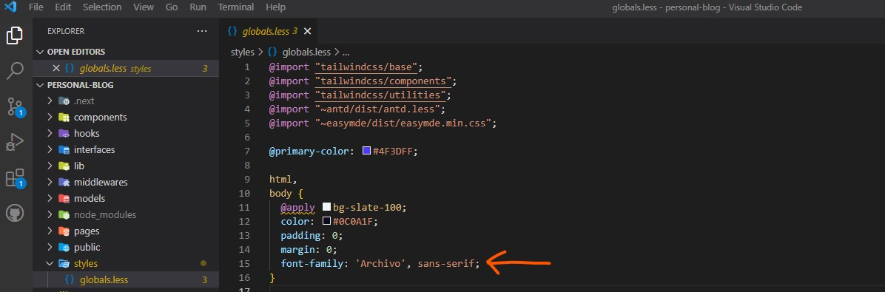

## Introduction,



This is a fully functioning personal blog built with [Next.js](https://nextjs.org/).

The app demo is available [here](https://personal-blog-trendly.vercel.app/).

- username: **admin@admin.com**
- password: **admin@2023**

The [login](https://personal-blog-trendly.vercel.app/admin/login) link is at the very bottom of the page, just before the social icons.

## Stack

- [Ant Design](https://ant.design/): _Very popular React UI library_
- [Tailwind CSS](https://tailwindcss.com/): _A utilify-first css framework_
- [MongoDB](https://www.mongodb.com/cloud/atlas/register): _Cross-platform document-oriented database program_
- [AWS S3](https://aws.amazon.com/s3/getting-started/): _Amazon Simple Storage Service - For post covers & post images_

## Requirements

### Version

- Node.js: v18.12.1
- NPM: v8.19.2
- MongoDB: v5.0.6

### MongoDB

- Production (recommended): _You need to [create a free MongoDB cloud account](https://www.mongodb.com/cloud/atlas/register). With the MongoDB cloud account, you can create **free clusters** as you wish and each with a storage capacity of 500MB._
- Development: _To work with mongodb locally, you must install the MongoDB community server on you computer. Check the [official site](https://www.mongodb.com/try/download/community) and download the version corresponding to your Operating System (OS)._

### AWS Account

- Create an AWS account: _You don't yet have an account, [check this link](https://aws.amazon.com/free/)._
- Create an publicly accessible AWS S3 bucket: _Follow [this article](https://www.simplified.guide/aws/s3/create-public-bucket)_
- Create access keys for you S3 bucket: _Follow [this article](https://www.filestash.app/aws-access-key.html)._

> Keep all the keys somewhere as they will be used in the environment variables file (`./.env.local`)

### SMTP credentials

The app will send an email to the admin every time someone subscribes to the newsletter.

- Development: _use [Mailtrap](https://mailtrap.io/) in development mode or any similar service_
- Production: _If you have a domain name, use third-party services like [Mailgun](http://mailgun.com/) & [Mailerlite](mailerlite.com) or any free smtp server._

> Npm comes with Node.js and you can download your OS's version on the [official site](https://nodejs.org/en/download/)

## File requirement

You must add a local environment variables file named `.env.local` in the root folder, with the following content:

```txt
NEXT_PUBLIC_APP_NAME=Trendly
NEXT_PUBLIC_APP_LOGO=
NEXT_PUBLIC_APP_TWITTER_USERNAME=

TOKEN_SECRET=
MONGODB_URI=

LOCAL_AWS_ACCESS_KEY=
LOCAL_AWS_SECRET_ACCESS_KEY=
LOCAL_AWS_API_VERSION=
LOCAL_AWS_REGION=
LOCAL_AWS_BUCKET_NAME=

SMTP_HOST=
SMTP_PORT=
SMTP_SECURITY=
SMTP_USERNAME=
SMTP_PASSWORD=

TEST_MODE=true
```

### TEST_MODE

When TEST_MODE=true, the adminstrator will not receive an email every time someone join the newsletter.

### Public variables:

- NEXT_PUBLIC_APP_NAME: The name of the app
- NEXT_PUBLIC_APP_LOGO: the full url of the app logo, that is going to be use in email header.
- NEXT_PUBLIC_APP_TWITTER_USERNAME: your twitter account username if you have (not mandatory)

### Private variables:

- TOKEN_SECRET: use a random string of a least 40 charaters
- MONGODB_URI: MongoDB connection url `(cluster dashboard > connect > connect your application > copy the url and replace the password)`

#### AWS variables

AWS variables start with `LOCAL_AWS_` as you noticed. You must have all this information from the requirements section.

#### SMTP variables

SMTP variables all start with `SMTP_`.

Once all the environment variables are available, you can get started as in the next section.

## Getting Started

- You have access to the repository: clone it
- You have the project zip: unzip it in a folder in your computer

First install dependencies:

```bash
npm install
```

First, run the development server:

```bash
npm run dev
```

Open [http://localhost:3000](http://localhost:3000) with your browser to see the result.

## How to change the app icon?

### Favicon

To update the favicon, we assume that you already have you logo file. Export the largest one and go to [https://realfavicongenerator.net/](https://realfavicongenerator.net/).
Follow the steps and download the zip file of the generated icons.

Unzip in the `./public` folder.

### How to change the app name and logo?

There are 2 components:

- AppName: ./components/AppName.tsx
- Logo: ./components/Logo.tsx

You can replace the `<Logo>` component by the actual logo of the app.

> I drawed the square manually just the void.

## How to change the primary color?

The current primary color of the app is `#4F3DFF`. To change it you need go through the following steps:

1. Open the global style file: `./styles/globals.less`
2. At the line **7**, change the value of `@primary-color` to the color you desire.



If you go around the app you will notice that in addition of colors provided natively by tailwind css, we have a variant called `primary`:
_bg-primary-500 text-primary-500 border-primary-500_.

You can see how i defined this `primary` variant in the tailwind configuration `./tailwind.config.js`, from the line **17** to **32**.



> **Disclaimer**: I didn't created all those shade by myself. To generate them, use [this amazing website](https://tailwind-colors.meidev.co/).
> _Select any color anywhere you want > [open the site](https://tailwind-colors.meidev.co/) > Click on "+ color" > replace "empty" by "primary" > Click on "+ Add Shade" > Replace "..." by 500 > Click on "+ Darker shade" **4** times > Click on "Lighter shade" until you reach the shade **50**._

## How to change the default text color?

To change the default text color, there are only two places:

- Global style file: `./styles/globals.less`: line **12**.
- Tailwind config file: `./tailwind.config.js`: line **16**.

> Check the lines in the previous images on the primary color section.

## How to change the font?

[Google fonts](https://fonts.google.com/) is one of the most accessible free fonts library.

To change the font, you need to open Google fonts and choose a font.

1. Then you select scroll down until you can select all possible variants:



2. Then you open the menu on the right as follows:



3. You copy the **links**:



4. Paste the links in the file `./pages/_document.tsx` as follows:



5. Copy the CSS rule to apply the font:



6. Apply the css as follows:



## Deploy on Vercel

The easiest way to deploy your Next.js app is to use the [Vercel Platform](https://vercel.com/new?utm_medium=default-template&filter=next.js&utm_source=create-next-app&utm_campaign=create-next-app-readme) from the creators of Next.js.

Check out our [Next.js deployment documentation](https://nextjs.org/docs/deployment) for more details.
